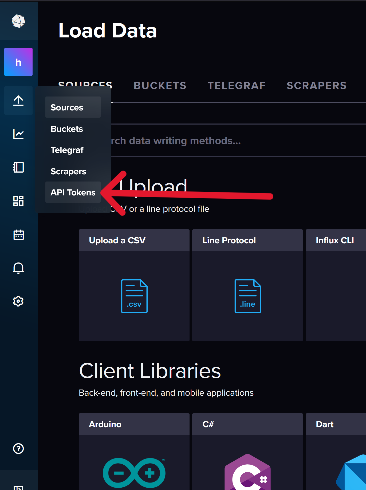
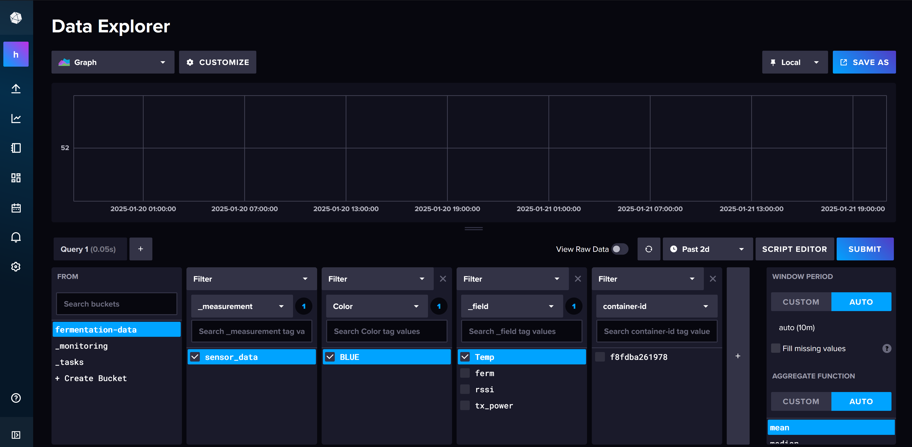
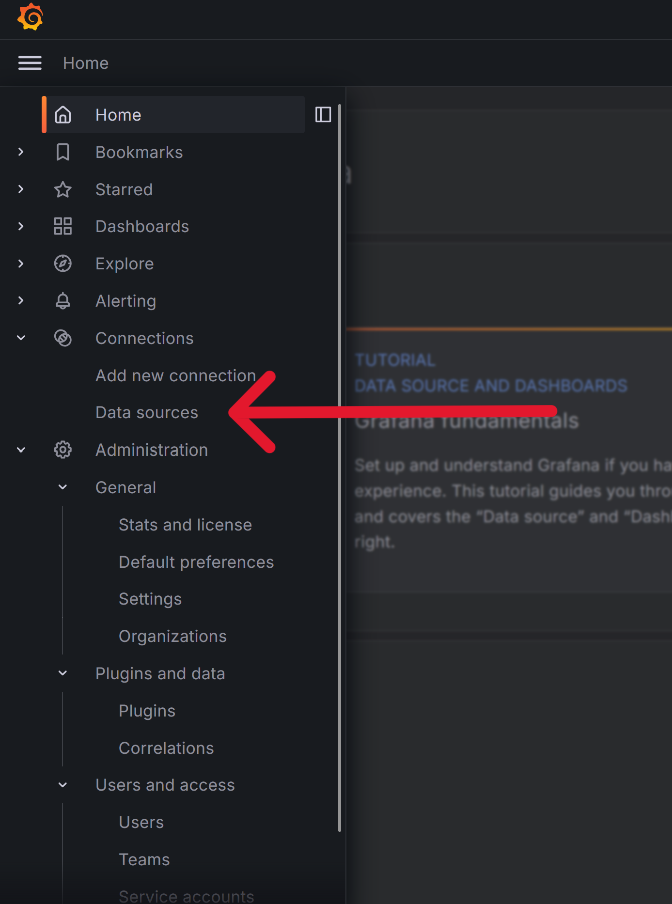
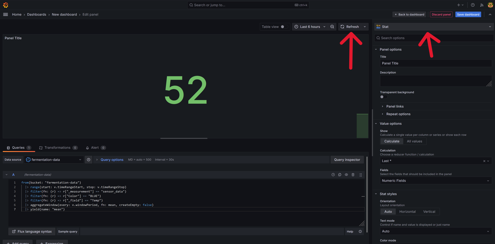

# Extracting Data from a Tilt Hydrometer and Displaying It Using Grafana

This guide will walk you step-by-step through setting up a monitoring stack with Docker to extract data from a Tilt Hydrometer and display it in Grafana. Together, we'll replicate the functionality of the Tilt Pi UI, including tracking gravity, temperature, and basic metrics. You'll also have room to expand into advanced Grafana features like ABV over time, apparent attenuation, and fermentation rate.

---

## Prerequisites: Setting Up Tilt Pi

To get started, you need to have a Tilt Pi installed on a Raspberry Pi with an active connection to your Tilt Hydrometer. If you haven’t set this up yet, you can follow one of the official guides:

- [Install Tilt Pi on Raspbian Buster](https://tilthydrometer.com/blogs/news/install-tilt-pi-on-raspbian-buster-compatible-with-all-rpi-models-including-rpi-4) (for a clean or existing Raspberry Pi installation).
- [Set Up Tilt Pi (Pre-installed Image)](https://tilthydrometer.com/blogs/news/how-to-set-up-tilt-pi-part-1) (for using a pre-installed image).

Once you've completed the installation, you’ll have a working Tilt Pi ready to connect with your Tilt Hydrometer.

---

## Setting Up Docker and Docker Compose

To build our monitoring stack, we’ll use Docker containers. If you're new to Docker, it's a tool for running applications in lightweight, isolated environments called containers. You can learn more about it from [Docker's official documentation](https://docs.docker.com/get-started/docker-overview/).

---

### Installing Docker and Docker Compose

We'll use a script to install Docker and Docker Compose. Open your terminal and run:

    curl -sSL https://get.docker.com | sh

This command will download and install Docker on your system. (I'd recommend looking over any script before you run it on your machine, this one is a handy one)

---

### Running Docker Without `sudo`

To avoid typing `sudo` every time you use Docker, add your user (who must have root privileges) to the Docker group:

    sudo usermod -aG docker $USER

After running this command, **log out** and then **log back in** for the changes to take effect.

---

### Testing Your Docker Installation

You can verify that Docker is installed and running correctly by executing:

    docker run hello-world

This will download and run a test container, printing a message to confirm that Docker is working.

---

## Networking with Docker

To ensure all our containers can communicate with each other, we need to place them on the same Docker network.

Run the following command to create a network called `tilt-pi-network`:

    docker network create tilt-pi-network

---

## Preparing the Directory Structure for Docker

To organize our Docker environment, we'll create a folder specifically for Docker and, within it, a `database` directory for InfluxDB and Telegraf. In this case my user's name is pi, but yours might be something different so change this accordingly:


```mkdir -p /home/pi/docker/database```

---

## Setting Up the Database Stack: InfluxDB and Telegraf

InfluxDB is a time-series database optimized for metrics and events, making it perfect for storing and analyzing fermentation data. Telegraf is a data collection agent that gathers metrics and forwards them to InfluxDB.

We'll now create a `docker-compose.yml` file to define our database stack. This file will configure two services: InfluxDB and Telegraf.

Navigate to the database folder you have just made

```cd /home/pi/docker/database```

---

### Docker Compose Configuration

 Use `nano` or your preferred text editor to create the `docker-compose.yml` file:

[Nano Editor Cheatsheet](https://www.nano-editor.org/dist/latest/cheatsheet.html)

`nano docker-compose.yml`

- Copy and paste the following content into the text editor:

Here is the `docker-compose.yml` file for our database stack:

```yaml
services:
  influxdb:
    image: influxdb:2
    container_name: influxdb
    restart: unless-stopped
    environment:
      DOCKER_INFLUXDB_INIT_MODE: setup
      DOCKER_INFLUXDB_INIT_USERNAME: ${INFLUXDB_ADMIN_USERNAME}
      DOCKER_INFLUXDB_INIT_PASSWORD: ${INFLUXDB_ADMIN_PASSWORD}
      DOCKER_INFLUXDB_INIT_ADMIN_TOKEN: ${INFLUXDB_ADMIN_TOKEN}
      DOCKER_INFLUXDB_INIT_ORG: ${INFLUXDB_ORG}
      DOCKER_INFLUXDB_INIT_BUCKET: ${INFLUXDB_BUCKET}
    ports:
      - "8086:8086"
    volumes:
      - /home/pi/docker/database/data:/var/lib/influxdb2
      - /home/pi/docker/database/config:/etc/influxdb2
    networks:
      - tilt-pi-network

  telegraf_tilt-pi-scraper:
    image: telegraf:latest
    container_name: telegraf_tilt-pi-scraper
    restart: unless-stopped
    environment:
      - INFLUX_TOKEN=${INFLUX_TOKEN}
      - INFLUX_ORG=${INFLUXDB_ORG}
      - INFLUX_BUCKET=${INFLUXDB_BUCKET}
      - INFLUX_URL=http://influxdb:8086
    volumes:
      - /home/pi/docker/database/tilt-pi-scraper_telegraf.conf:/etc/telegraf/telegraf.conf:ro
    networks:
      - tilt-pi-network

networks:
  tilt-pi-network:
    external: true
``` 

---


Now hit `Ctrl+S` to save, then `Ctrl+X` to exit.


### Creating the `.env` File

To securely store sensitive credentials and allow for easier configuration, create a `.env` file in the same directory as the `docker-compose.yml` file (the `database` folder). Add the following content:

`nano .env`


```
# InfluxDB Admin Credentials
INFLUXDB_ADMIN_USERNAME=your_admin_username
INFLUXDB_ADMIN_PASSWORD=your_admin_password
INFLUXDB_ADMIN_TOKEN=your_admin_token

# InfluxDB Organization and Bucket
INFLUXDB_ORG=homebrew
INFLUXDB_BUCKET=fermentation-data

# Telegraf Token
INFLUX_TOKEN=you-will-generate-this-later-in-influxDB-dashboard
```

Replace `your_admin_username`, `your_admin_password`, and `your_admin_token` with values of your choice. Keep the influxDB values as they are unless you know what you are doing. You will need to generate an API token later and update the `INFLUX_TOKEN` field.

---

## Starting the InfluxDB Service

Now that we have defined our `docker-compose.yml` file, we’ll start the InfluxDB service.

Run the following command from the directory containing your `docker-compose.yml` file:

    docker compose up -d influxdb

This command starts *only* the `influxdb` service. It will download the required image if it’s not already on your system and initialize InfluxDB using the credentials and settings specified in the `.env` file.

---

### Verifying InfluxDB is Running

Now we will quickly check if our databse is running before setting up Telegraf

Once the command completes, open your browser and navigate to:

    http://<your-raspberry-pi-ip>:8086

You should see the InfluxDB web UI ogin page. Log in using the credentials you defined in the `.env` file.

    
### InfluxDB Admin Credentials
    INFLUXDB_ADMIN_USERNAME=your_admin_username
    INFLUXDB_ADMIN_PASSWORD=your_admin_password

#### Troubleshooting

If you do not see a dashboard, check your ip is correct and use
    
    docker logs influxdb

To check the logs of the container. You should be able to work out what is misconfigured from there.

---

## Configuring InfluxDB for Telegraf

Now that we’ve logged into InfluxDB and see the dashboard, we’ll create the API token Telegraf needs to write data to the database.

---


### 1. Navigate to API Tokens

On the left-hand side menu, hover over the upward pointing arrow (Load data), go to **API Tokens**. This is where we’ll generate a custom token to allow Telegraf to write data to our database and for Grafana to read that data.



### 2. Generate a Custom Token

1. Click **Generate API Token**.
2. Choose **Custom API Token**.
3. Give the token a meaningful description, like `telegraf_fermentation`.
4. select **Buckets**
5. Set **Write Permissions** abd **Read Permissions** for the `fermentation-data` bucket using the checkboxes

Click **Generate** to generate the token.


A window will pop up with your newly created API token. You will only be able to see this once, so copy it and paste it somewhere for use later.

**Note:** There is a known bug where the copy button does not work properly, so highlight the token and copy it.

### 3. Update the `.env` File

with your copied API token, update your `.env` file with the following line:

    nano .env

and update the INfLUX_TOKEN value

    INFLUX_TOKEN=your-newly-generated-token-here

save and exit

---

## Creating the Telegraf Configuration File

Now that we’ve set up InfluxDB and generated our API token, the next step is to configure Telegraf to scrape data from the Tilt Pi and send it to InfluxDB.

### 1. Create the Telegraf Configuration File

Navigate to the directory where your `docker-compose.yml` file is stored:

`cd /home/pi/docker/database`

Use `nano` or your preferred text editor to create the Telegraf configuration file:

    nano tilt-pi-scraper_telegraf.conf

### 2. Input the Configuration

Copy and paste the following into the `tilt-pi-scraper_telegraf.conf` file:

 - **IMPORTANT** Replace `<your-raspberry-pi-ip>` with the IP address of your Raspberry Pi at the top keeping the `:1880/macid/all` after your ip.

```
[[inputs.http]]
  data_format = "json_v2"
  name_override = "sensor_data"
  urls = ["http://<your-raspberry-pi-ip>:1880/macid/all"]
  interval = "1m"
  response_timeout = "30s"
  method = "GET"


[[inputs.http.json_v2]]
  measurement_name = "sensor_data"

  [[inputs.http.json_v2.object]]
    path = "0"  # Targets the first element in the array

    # Tags
    [[inputs.http.json_v2.object.tag]]
      path = "Color"

    # Fields
    [[inputs.http.json_v2.object.field]]
      path = "tx_power"
      type = "int"

    [[inputs.http.json_v2.object.field]]
      path = "rssi"
      type = "int"

    [[inputs.http.json_v2.object.field]]
      path = "Temp"
      type = "float"

    [[inputs.http.json_v2.object.field]]
      path = "ferm"
      type = "float"


# Output Plugin: InfluxDB v2
[[outputs.influxdb_v2]]
  urls = ["${INFLUX_URL}"]
  token = "${INFLUX_TOKEN}"
  organization = "${INFLUX_ORG}"
  bucket = "${INFLUX_BUCKET}"

[[processors.rename]]

  [[processors.rename.replace]]
    tag = "host"
    dest = "container-id"
```

Save and exit the file.

- **Optional Interval Configuration**: The `interval` parameter defines how often Telegraf scrapes data from the Tilt Pi. In this example, it's set to `1m` the default. 
  - If you're using an low spec SD card for storage or running on a lower-spec Raspberry Pi, increasing this interval (e.g., `5m` or `10m`) may help reduce writes and storage usage. If you change this value due to hardware constraints, you may want to consider changing the `response_timeout` value as well.

### 3. Start the Telegraf Service

With the configuration in place, we are ready to start sending data to influxDB:

    docker compose up -d

---

## Verifying Data in InfluxDB

Now that the Telegraf service is running, we’ll confirm that data from the Tilt Pi is being received by our InfluxDB database.


### 1. Open the InfluxDB Dashboard

In your browser, navigate to your InfluxDB instance:

    http://<your-raspberry-pi-ip>:8086

### 2. Verify Data in the Bucket

Once logged in:

1. Navigate to the **Data Explorer** section from the left-hand menu (upward arrow).
2. Select **Buckets**
3. Select the `fermentation-data` bucket.
4. Use the query builder to select data associated with the `sensor_data` measurement.
5. After selecting `sensor_data` you should see `Color`. Select your Tilt Color
6. Then you will see all of the sensor outputs: **Temp**, **ferm**, **rssi**, and **tx_power** select one or all of these and hit submit. You should see some vlaues plotted above (won't be much because it just started logging data)

If you see the expected data, your setup is working correctly, and InfluxDB is receiving information from Telegraf.



### Troubleshooting Tips

- **No Data in the Bucket**:
  - Check the logs for the Telegraf container:  
    `docker logs telegraf_tilt-pi-scraper`
  - Verify the `tilt-pi-scraper_telegraf.conf` file for typos, especially the `urls` field.
  - Ensure the IP address of your Tilt Pi is correct and reachable.

---

  ## Setting Up the Grafana Visualization Container

Now we will set up our data visualization. We will create a **Grafana** container using Docker Compose.

### 1. Prepare the Directory Structure

Navigate to your Docker directory and create a folder for Grafana:

    cd /home/pi/docker  
    mkdir grafana  
    cd grafana  

### 2. Create the Docker Compose File

Create a **new** `docker-compose.yml` file for Grafana:

    nano docker-compose.yml

Paste the following content into the file, ensuring the paths align with your pi username:

```
services:
  grafana:
    image: grafana/grafana:latest
    container_name: grafana
    restart: unless-stopped
    user: '0'
    ports:
      - '3000:3000'
    volumes:
      - '/home/pi/docker/grafana/data:/var/lib/grafana'
    networks:
      - tilt-pi-network

networks:
  tilt-pi-network:
    external: true
```

Save and exit the file.

### 3. Start the Grafana Container

Run the following command to start the Grafana container:

    docker compose up -d

This will create and start the Grafana service.

### 4. Access the Grafana Dashboard

Open your browser and open a new tab to:

    http://<your-raspberry-pi-ip>:3000

You should see the Grafana login screen. Use the default credentials to log in:

- **Username**: admin  
- **Password**: admin  

Grafana will prompt you to change the default password after your first login. Choose a secure password and proceed. You should be greeted by the dashboard.

---

## Connecting Grafana to InfluxDB

Now that Grafana is running, we need to connect it to our InfluxDB database to start visualizing data.

### 1. Access Data Sources

On the left-hand side of the Grafana dashboard, in the "burger" menu look for the **Connections** tab. Click on **Data Sources**.  



Next, click **Add Data Source** and select **InfluxDB**. 
- If InfluxDB does not appear as a suggestion, use the search bar to find it.

### 2. Configure the Data Source

In the Data Source settings, configure the following fields:

- **Name**: Rename the data source to `fermentation-data`.
- **Query Language**: Change this to `Flux`.
- **URL**: Enter this exact url --> `http://influxdb:8086`.
- **Basic Auth**: Uncheck this option.
- **Organization**: Enter `homebrew` (or the organization name you used in your `.env` file).
- **Token**: paste your token from influx from earlier


Click **Save & Test**. 

If everything is set up correctly, you should see a green box that says:

**Datasource is working. 1 bucket found.**

This confirms that Grafana is now connected to your InfluxDB database.


---

## Visualizing Your Tilt Hydrometer Data

Now for the fun part! We can finally visualize the data coming from our Tilt Hydrometer in Grafana.

### 1. Create a Dashboard in Grafana

1. Click on **Dashboard** in the left-hand menu.
2. Select **Create Dashboard** and then click **Add Visualization**.
3. In the visualization settings, select your data source (`fermentation-data`).

### 2. Editing a Panel

We are now in a panel editor. By default, the visualization type at the top right is set to "Time Series". We can change it to "Stat" for a cleaner display of individual metrics like temperature or specific gravity (SG).


### 3. Use the InfluxDB Query Builder

Open a new tab and go to the InfluxDB dashboard and into the **Data Explorer** tab

InfluxDB Data Explorer provides a **Query Builder** tool that can help generate the correct Flux query for your specific setup. Use this to create your query with all the right values. Then select the script editor, and finally copy and paste it into Grafana.

#### Example query

```
from(bucket: "fermentation-data")  
  |> range(start: v.timeRangeStart, stop: v.timeRangeStop)  
  |> filter(fn: (r) => r["_measurement"] == "sensor_data")  
  |> filter(fn: (r) => r["Color"] == "BLUE")  
  |> filter(fn: (r) => r["_field"] == "Temp")   
  |> aggregateWindow(every: v.windowPeriod, fn: mean, createEmpty: false)  
  |> yield(name: "mean")
```


### 4. View Your Dashboard

Once the query is pasted into the grafana, you can hit **refresh** to see if your query has worked, and then hit back to dashboard.

Repeat this process to add visualizations for SG (specific gravity), RSSI (signal strength), or any other data points provided by the Tilt Hydrometer. With a few additions, you’ll have a simple dashboard that replicates much of the functionality of the Tilt Pi UI, with room for expansion into more complex data analysis and visualization. 

---

### Example Dashboard

Here’s an example of my current dashboard. Note that when we added dry hops to the Stone Cold IPA, it temporarily disturbed the SG reading, but it eventually settled out.

### Lucky Jack APA


### Stone Cold IPA Dashboard


---

### What can this be used for?

Using this pipeline and Grafana for visualization, you can:

- Monitor **current data**
- Identify **trends** during fermentation.
- Export and compare data across fermentation periods.

This information allows you to make better decisions and ultimately brew better beer. Enjoy your newfound brewing insights!

This guide covers the basics of getting information into Grafana and visualizing it. The goal of this guide was to keep things as simple as possible.

---

### Note on Using Many Tilt Hydrometers

The provided configuration in `tilt-pi-scraper_telegraf.conf` uses the **Color** attribute as a tag to differentiate data. If you have multiple Tilt Hydrometers and would like to uniquely identify them, you can modify the configuration to use the **uuid** as the identifier instead of the Color tag or alongside the tag. This ensures that each hydrometer's data is distinctly tracked, even if they share the same Color attribute.
